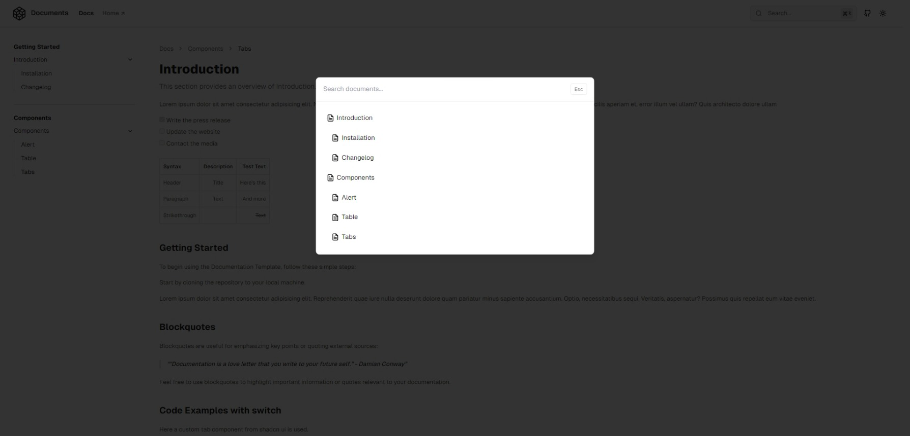

# Documents

**Documents** es un potente kit de inicio de documentación de **Next.js** diseñado para simplificar el proceso de creación de documentación de productos, manuales técnicos y guías comerciales integrales y de alta calidad. Desarrollado con **React**, **Tailwind CSS** y **TypeScript**, este kit de inicio proporciona la base para crear la documentación de su proyecto y su base de conocimientos.

**Demo**: [https://rubix-documents.vercel.app/](https://rubix-documents.vercel.app/)

[](https://vercel.com/new/clone?repository-url=https%3A%2F%2Fgithub.com%2Frubixvi%2Frubix-documents&project-name=my-documents&repository-name=my-documents&demo-title=Documents&demo-description=This%20Document%20Starter%20Kit%20is%20developed%20with%20Next.js%2C%20Tailwind%20CSS%20and%20TypeScript.%20It%20serves%20as%20a%20flexible%20and%20scalable%20foundation%20for%20building%20documentation%20websites%20or%20content-driven%20projects.&demo-url=https%3A%2F%2Frubix-documents.vercel.app%2F&demo-image=https%3A%2F%2Fgithub.com%2Frubixvi%2Frubix-documents%2Fblob%2Fmain%2Fpublic%2Fscreens%2Fscreen-1.png)

## Tabla de contenido

- [Instalación](#instalación)
- [Uso](#uso)
- [Características](#características)
- [Contribuyendo](#contribuyendo)
- [Licencia](#licencia)
- [Contacto](#contacto)

## Desarrollo

[https://docs.rubixstudios.com.au](https://docs.rubixstudios.com.au) **(En-desarrollo)**

## Development

### Instalación

1. Clonar el repositorio:

   ```bash
   git clone https://github.com/cjhirashi/programing-documents.git
   cd programing-documents
   ```

2. Instalar dependencias:

   ```bash
   npm install
   ```

3. Ejecute el servidor de desarrollo:

   ```bash
   npm run dev
   ```

4. Abra [http://localhost:3000](http://localhost:3000) en su navegador para ver el proyecto.

5. **Para producción:**

   - Construye la aplicación:

     ```bash
     npm run build
     ```

   - Iniciar el servidor de producción:

     ```bash
     npm run start
     ```

   - Abra [http://localhost:3000](http://localhost:3000) para ver la versión de producción.

   - **Si se implementa en Vercel,** El paso de compilación se gestiona automáticamente durante la implementación.

## Uso

Este kit se puede utilizar para crear documentación de productos, sitios web comerciales y guías.


_Pantalla principal_


_Pantalla de documento_


_Pie de página del documento_


_Búsqueda de documentos_


_Pantalla principal del modo oscuro_


_Pantalla del modo oscuro del documento_

## Características

### Creación de contenido

- **Integración MDX**: Escriba documentos con componentes Markdown y JSX.
- **Componentes personalizados**: Reutiliza los componentes de React en tus documentos.
- **Diagramas de Mermaid.js**: Crear diagramas y diagramas de flujo.
- **Matemáticas y tablas**: Incluye tablas y fórmulas matemáticas LaTeX.

### Navegación y legibilidad

- **Navegación multinivel**: Páginas anidadas para jerarquía.
- **Paginación de contenido**: Transiciones suaves entre páginas.
- **TOC dinámico**: Tabla de contenidos generada automáticamente.
- **Cambiador de código**: Alterne y copie fragmentos de código fácilmente.

### Características del código

- **Syntax Highlighting**: Resaltado según el tema.
- **Bloques de código mejorados**: Resaltado de líneas y títulos de códigos.

### Tematización y experiencia de usuario

- **Modos claro/oscuro**: Cambio automático de tema.
- **Optimización SEO**: Metadatos generados automáticamente para una mejor clasificación.
  - Administrar metaetiquetas (title, description, URLs, social sharing).

### Búsqueda y mejoras futuras

- **Búsqueda avanzada**: Búsqueda difusa con resaltado de términos.
- **Base de conocimientos de IA**: Futuras herramientas de documentación impulsadas por IA.

> **Nota:** El soporte de documentación de IA está en desarrollo.

## Contribuyendo

1. Fork the repository.
2. Create a new branch (`git checkout -b feature-branch`).
3. Make your changes.
4. Commit your changes (`git commit -m 'Add some feature'`).
5. Push to the branch (`git push origin feature-branch`).
6. Open a pull request.

## Licencia

This project is licensed under the MIT License. See the [LICENSE](./LICENSE) file for details.

## Contacto

For support or inquiries, contact Vincent Vu [@rubixvi](https://x.com/rubixvi) on X.

Rubix Studios - [https://www.rubixstudios.com.au](https://www.rubixstudios.com.au)

Project: [https://github.com/rubixvi/rubix-documents](https://github.com/rubixvi/rubix-documents)
