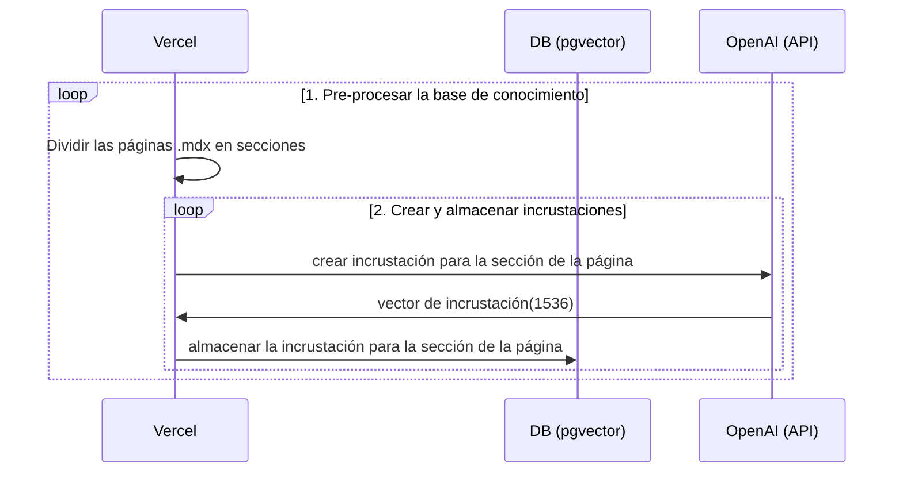
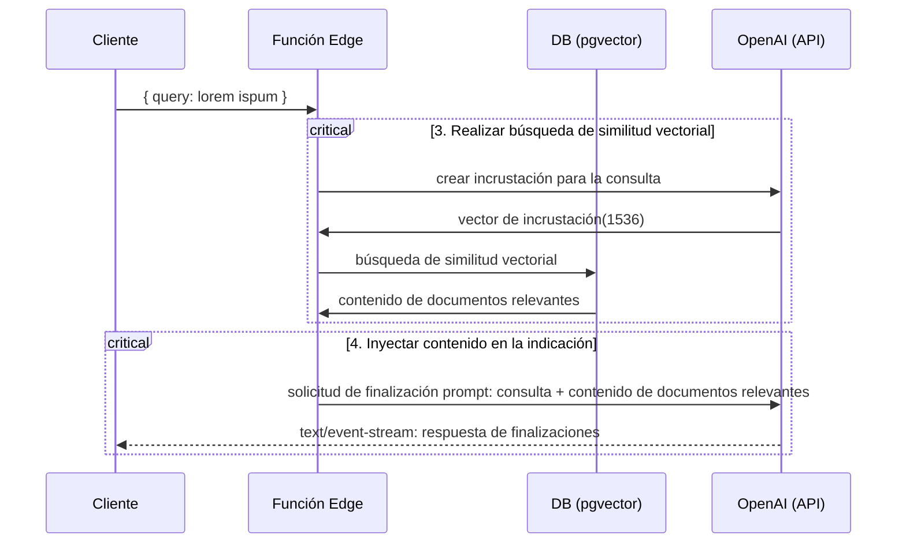

## LINKS

<CardGrid>
  <Card
    title="Template"
    href="https://vercel.com/templates/next.js/nextjs-openai-doc-search-starter"
    icon="alignJustify"
    variant="small"
    external={true}
  />
  <Card
    title="Demo"
    href="#"
    icon="alignJustify"
    variant="small"
    external={true}
  />
  <Card
    title="Respositorio GitHub"
    href="https://github.com/supabase-community/nextjs-openai-doc-search"
    icon="alignJustify"
    variant="small"
    external={true}
  />
  
</CardGrid>
---

## DESCRIPCION GENERAL 

Este iniciador toma todos los archivos `.mdx` en el directorio `pages` y los procesa para usarlos como contexto personalizado dentro de las indicaciones de [Finalización de texto de OpenAI](https://platform.openai.com/docs/guides/completion).

### STACK TECNOLOGICO

* **Framework**: Next.js
* **Caso de uso**: AI
* **CSS**: Tailwind
* **Database**: Supabase

### LICENCIA

Apache 2.0

### CARACTERISTICAS

## Despliegue

Despliega este iniciador en Vercel. La integración de Supabase establecerá automáticamente las variables de entorno requeridas y configurará tu [Esquema de base de datos](./supabase/migrations/20230406025118_init.sql). ¡Todo lo que tienes que hacer es configurar tu `OPENAI_KEY` y estarás listo!

## Detalles Técnicos

Construir tu propio ChatGPT personalizado implica cuatro pasos:

1. [👷 Tiempo de compilación] Pre-procesar la base de conocimiento (tus archivos `.mdx` en tu carpeta `pages`).
2. [👷 Tiempo de compilación] Almacenar los embeddings  en Postgres con [pgvector](https://supabase.com/docs/guides/database/extensions/pgvector).
3. [🏃 Tiempo de ejecución] Realizar una búsqueda de similitud vectorial para encontrar el contenido que sea relevante para la pregunta.
4. [🏃 Tiempo de ejecución] Inyectar contenido en la indicación de finalización de texto de OpenAI GPT-3 y transmitir la respuesta al cliente.

## 👷 Tiempo de Compilación

Los pasos 1 y 2 ocurren en tiempo de compilación, por ejemplo, cuando Vercel construye tu aplicación Next.js. Durante este tiempo, se está ejecutando el script [`generate-embeddings`](./lib/generate-embeddings.ts), que realiza las siguientes tareas:

<Mermaid
  chart={`
    sequenceDiagram
    participant Vercel
    participant DB (pgvector)
    participant OpenAI (API)
    loop 1. Pre-procesar la base de conocimiento
        Vercel->>Vercel: Dividir las páginas .mdx en secciones
        loop 2. Crear y almacenar incrustaciones
            Vercel->>OpenAI (API): crear incrustación para la sección de la página
            OpenAI (API)->>Vercel: vector de incrustación(1536)
            Vercel->>DB (pgvector): almacenar la incrustación para la sección de la página
        end
    end
  `}
/>

Además de almacenar las incrustaciones, este script genera una suma de comprobación para cada uno de tus archivos `.mdx` y la almacena en otra tabla de la base de datos para asegurarse de que las incrustaciones solo se regeneren cuando el archivo haya cambiado.

## 🏃 Tiempo de Ejecución

Los pasos 3 y 4 ocurren en tiempo de ejecución, cada vez que el usuario envía una pregunta. Cuando esto sucede, se realiza la siguiente secuencia de tareas:

<Mermaid
  chart={`
    sequenceDiagram
    participant Cliente
    participant Función Edge
    participant DB (pgvector)
    participant OpenAI (API)
    Cliente->>Función Edge: { query: lorem ispum }
    critical 3. Realizar búsqueda de similitud vectorial
        Función Edge->>OpenAI (API): crear incrustación para la consulta
        OpenAI (API)->>Función Edge: vector de incrustación(1536)
        Función Edge->>DB (pgvector): búsqueda de similitud vectorial
        DB (pgvector)->>Función Edge: contenido de documentos relevantes
    end
    critical 4. Inyectar contenido en la indicación
        Función Edge->>OpenAI (API): solicitud de finalización prompt: consulta + contenido de documentos relevantes
        OpenAI (API)-->>Cliente: text/event-stream: respuesta de finalizaciones
    end
  `}
/>

Los archivos relevantes para esto son el componente [`SearchDialog` (Cliente)](./components/SearchDialog.tsx) y la [`vector-search` (Función Edge)](./pages/api/vector-search.ts).

La inicialización de la base de datos, incluida la configuración de la extensión `pgvector`, se almacena en la [`carpeta supabase/migrations`](./supabase/migrations/), que se aplica automáticamente a tu instancia local de Postgres cuando se ejecuta `supabase start`.

## Desarrollo Local

### Configuración

- `cp .env.example .env`
- Configura tu `OPENAI_KEY` en el archivo `.env` recién creado.
- Configura `NEXT_PUBLIC_SUPABASE_ANON_KEY` y `SUPABASE_SERVICE_ROLE_KEY` ejecutando:
  > Nota: Tienes que ejecutar supabase para recuperar las claves.

### CONTACTO 
---
## CLONAR REPOSITORIO 

<Step>
  <StepItem title="Clonar repositorio">
   
    Contenido 1

  </StepItem>

  <StepItem title="Conectar con nuevo repositorio de GitHub">
    
    Contenido 2

  </StepItem>

  <StepItem title="Instalar dependencias">
    
    Contenido 3

  </StepItem>
</Step>
